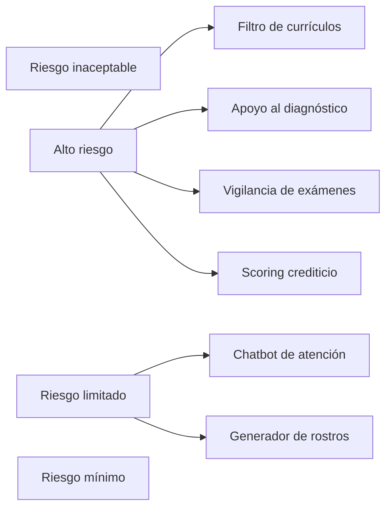

# Act 1.1:
De esta materia espero adquirir una base sobre los marcos normativos y las responsabilidades legales que tienen tanto los desarrolladores como los usuarios de sistemas de inteligencia artificial

Espero aprender a aplicar las normativas de protección de datos y principios para la privacidad y los derechos individuales. Así como saber el como se aplica en diferentes sectores 
# Act 1.2: Sustitución del INAI y organismos equivalentes internacionales

> [!info] Instrucción
> Investigar qué organismo sustituyó al INAI y los organismos similares en Estados Unidos y la Unión Europea.

## México: Sustitución del INAI
Tras las reformas legislativas de 2025, el **Instituto Nacional de Transparencia, Acceso a la Información y Protección de Datos Personales (INAI)** desapareció. 

Sus facultades y funciones fueron absorbidas por:
- **Nuevo Organismo:** Transparencia para el Pueblo (órgano administrativo desconcentrado).
- **Dependencia:** Pertenece a la **Secretaría Anticorrupción y Buen Gobierno**, la cual depende directamente del Poder Ejecutivo.

---

## Estados Unidos: Organismos similares
A diferencia de México, en EE. UU. no existe un órgano centralizado único. Las funciones están divididas:

### Protección de Datos y Privacidad
- No hay una ley federal general ni un único organismo.
- **Principal autoridad:** La **Federal Trade Commission (FTC)** (Comisión Federal de Comercio) supervisa el cumplimiento de las normativas de privacidad y protección al consumidor a nivel federal.
- *Nota:* Las leyes varían mucho dependiendo de cada estado.

### Transparencia y Acceso a la Información
- El acceso público se rige bajo la **Freedom of Information Act (FOIA)** (Ley de Libertad de Información).
- **Supervisión:** A cargo de la **OIP** (Oficina de Política de Información del Departamento de Justicia) y la **OGIS** (Oficina de Servicios de Información del Gobierno).

---

## Unión Europea: Organismos similares
La UE cuenta con autoridades altamente especializadas, operando a nivel central y coordinando con cada país miembro.

### Protección de Datos Personales
- **EDPS (Supervisor Europeo de Protección de Datos):** Organismo independiente responsable a nivel de las instituciones europeas.
- **EDPB (Comité Europeo de Protección de Datos):** Se encarga de coordinar a las diferentes autoridades nacionales de protección de datos de cada país (como la AEPD en España o la CNIL en Francia).

### Transparencia y Acceso a la Información
- **Defensor del Pueblo Europeo (European Ombudsman):** Los ciudadanos pueden recurrir a él para investigar quejas sobre mala administración, falta de transparencia o negación injustificada en el acceso a documentos por parte de las instituciones de la UE.

# Act 1.2: Sustitución del INAI y organismos equivalentes internacionales:
**Artículo 6° - Acceso a la información**  
    Reconoce el derecho a la información pública y, en su apartado A, los principios de **protección de datos personales**. Es la raíz constitucional de toda la legislación de datos en México.
    El **derecho a la información** será garantizado por el Estado.
	Toda persona tiene derecho al **libre acceso a información**, así como a **buscar, recibir y difundir información e ideas de toda índole por cualquier medio de expresión**.
	La ley establecerá las bases, procedimientos y condiciones para el **acceso a la información y para la protección de datos personales**.
- **Artículo 16 - Protección de datos personales**  
    Establece que toda persona tiene derecho a la **protección de sus datos personales**, y a acceder, rectificar y cancelar los mismos, así como a manifestar su oposición: los **derechos ARCO**.
    Toda persona tiene derecho a la **protección de sus datos personales**, al **acceso, rectificación y cancelación** de los mismos, así como a manifestar su **oposición**.
- **Artículo 7º - Libertad de expresión y difusión**  
    Aplica a **contenidos digitales y plataformas**. Marca el límite entre moderar contenido y censurar, un tema central para sistemas automatizados de filtrado.
    Es inviolable la **libertad de difundir opiniones, información e ideas, a través de cualquier medio**.
	Ninguna ley ni autoridad puede establecer la previa censura, ni coartar la **libertad de difusión**.
- **Artículo 1º - Derechos humanos y no discriminación**  
    Prohíbe toda discriminación motivada por origen étnico, género, edad, discapacidad o condición social. Es la base para reclamar por **discriminación algorítmica**.
    Queda prohibida toda discriminación motivada por origen étnico o nacional, género, edad, discapacidades, condición social, condiciones de salud, religión, opiniones, preferencias sexuales, estado civil o cualquier otra que **atente contra la dignidad humana y tenga por objeto anular o menoscabar los derechos y libertades de las personas**.

# Act 1.3: **Propuestas de regulación de AI**

| Suplantación de identidad                      |
| ---------------------------------------------- |
| Datos que se usan para entrenar el modelo   |
| Ciberataques                                |
| Restricciones en temas de salud             |
| Creación de contenido ilegal (obsceno)      |
| Derechos de autor                           |
| Regulación en suplantación de profesiones   |

# Act 1.4:

- **Suplantación de identidad:** Ocurre cuando alguien utiliza los datos o la imagen de otra persona para hacerse pasar por ella.
- **Datos que se usan para entrenar el modelo:** La IA aprende a partir de grandes cantidades de información, por lo que es importante saber de dónde provienen esos datos y cómo se utilizan.
- **Ciberataques:** Son acciones realizadas para dañar, robar información o acceder sin permiso a sistemas y dispositivos.
- **Restricciones en términos de uso:** Son las reglas que establecen qué está permitido y qué está prohibido al utilizar una aplicación o servicio de IA.
- **Creación de contenido ilegal (abuso):** La IA puede ser utilizada para crear contenido dañino o ilegal, por lo que existen normas para prevenir y sancionar su uso indebido.
- **Derechos de autor:** Protegen las obras creadas por las personas y establecen cómo pueden utilizarse, copiarse o modificarse.
- **Regulación en la suplantación de profesiones:** Busca evitar que una persona o sistema se haga pasar por un profesional autorizado, especialmente en áreas donde se requiere preparación y certificación.
- **Responsabilidad de la Inteligencia Artificial:** Se refiere a determinar quién es responsable cuando una IA causa un daño o toma una decisión que afecta a una persona.
# Act 1.5: Clasificación de sistemas de IA

